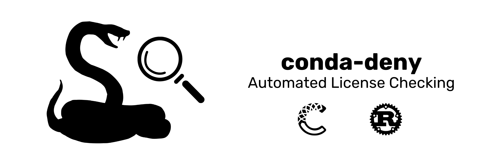

<picture>
  <source media="(prefers-color-scheme: dark)" srcset="./.github/assets/conda-deny-banner-dark.png">
  <source media="(prefers-color-scheme: light)" srcset="./.github/assets/conda-deny-banner-light.png">
  
</picture>

<div align="center">

[![License][license-badge]](LICENSE)
[![CI Status][ci-badge]][ci]
[![Binary Build][binary-build-badge]][binary-build]
[![Conda Platform][conda-badge]][conda-url]
[![Conda Downloads][conda-downloads-badge]][conda-url]
[![Codecov][codecov]][codecov-url]

[license-badge]: https://img.shields.io/github/license/quantco/conda-deny?style=flat-square

[ci-badge]: https://img.shields.io/github/actions/workflow/status/quantco/conda-deny/ci.yml?branch=main&style=flat-square&label=CI
[ci]: https://github.com/quantco/conda-deny/actions/workflows/ci.yml

[binary-build-badge]: https://img.shields.io/github/actions/workflow/status/quantco/conda-deny/build.yml?branch=main&style=flat-square&label=Binary%20Build
[binary-build]: https://github.com/quantco/conda-deny/actions/workflows/build.yml

[conda-badge]: https://img.shields.io/conda/vn/conda-forge/conda-deny?style=flat-square
[conda-downloads-badge]: https://img.shields.io/conda/dn/conda-forge/conda-deny?style=flat-square
[conda-url]: https://prefix.dev/channels/conda-forge/packages/conda-deny

[codecov]: https://img.shields.io/codecov/c/github/quantco/conda-deny/main?style=flat-square
[codecov-url]: https://codecov.io/gh/Quantco/conda-deny

</div>

## 🗂 Table of Contents

- [Introduction](#-introduction)
- [Installation](#-installation)
- [Usage](#-usage)

## 📖 Introduction

conda-deny is a CLI tool for checking software environment dependencies for license compliance.
Compliance is checked with regard to an allowlist of licenses provided by the user.

## 💿 Installation

You can install `conda-deny` using `pixi`:

```bash
pixi global install conda-deny
```

Or by downloading our pre-built binaries from the [releases page](https://github.com/quantco/conda-deny/releases).

## 🎯 Usage


`conda-deny` can be configured in your `pixi.toml` or `pyproject.toml` (`pixi.toml` is preferred).
The tool expects a configuration in the following format:

```toml
[tool.conda-deny]
#--------------------------------------------------------
# General setup options:
#--------------------------------------------------------
license-allowlist = "https://raw.githubusercontent.com/quantco/conda-deny/main/tests/test_remote_base_configs/conda-deny-license_allowlist.toml" # or ["license_allowlist.toml", "other_license_allowlist.toml"]
platform = "linux-64" # or ["linux-64", "osx-arm64"]
environment = "default" # or ["default", "py39", "py310", "prod"]
lockfile = "environment/pixi.lock" # or ["environment1/pixi.lock", "environment2/pixi.lock"]
# lockfile also supports glob patterns:
# lockfile = "environments/**/*.lock"

#--------------------------------------------------------
# License allowlist directly in configuration file:
#--------------------------------------------------------
safe-licenses = ["MIT", "BSD-3-Clause"]
ignore-packages = [
    { package = "make", version = "0.1.0" },
]
```

After installing `conda-deny`, you can run `conda-deny check` in your project.
This then checks `pixi.lock` to determine the packages (and their versions) used in your project.

### 🔒 Authorized access to allowlist

If a Bearer Token is needed to access your allowlist, you can provide it using `CONDA_DENY_BEARER_TOKEN`.
An example use case would be a private repository containing your allowlist.

### ✨ Output Formats

`conda-deny` supports different output formats via the `--output` (or `-o`) flag.
Output formatting works for both, the `list` and the `check` command.
To get an overview of the different format options, try:

```bash
$ conda-deny list --output csv
package_name,version,license,platform,build,safe
_openmp_mutex,4.5,BSD-3-Clause,linux-aarch64,2_gnu,false
_openmp_mutex,4.5,BSD-3-Clause,linux-64,2_gnu,false
...

$ conda-deny list --output json-pretty
{
  "unsafe": [
    {
      "build": "conda_forge",
      "license": {
        "Invalid": "None"
      },
      "package_name": "_libgcc_mutex",
      "platform": "linux-64",
      "version": "0.1"
    },
    {
      "build": "h57d6b7b_14",
      "license": {
        "Invalid": "LGPL-2.0-or-later AND LGPL-2.0-or-later WITH exceptions AND GPL-2.0-or-later AND MPL-2.0"
      },
      "package_name": "_sysroot_linux-aarch64_curr_repodata_hack",
      "platform": "noarch",
      "version": "4"
    },
...
```
